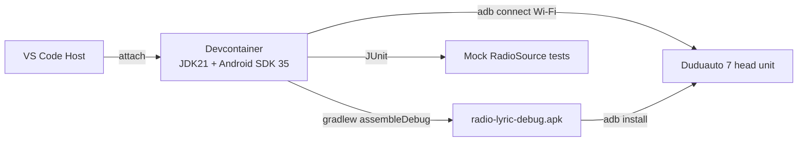

<!-- markdownlint-disable-file -->
# Task Research: Devcontainer for Android Kotlin Development

Design a VS Code devcontainer suitable for building, testing, and debugging an Android Kotlin app (the `radio-lyric` head-unit DAB + lyrics app), including SDK, NDK, Gradle, Kotlin, JDK, lint/static analysis, emulator strategy, and ADB to a remote in-car device over Wi-Fi.

## Task Implementation Requests

* Recommend a base image (official Microsoft devcontainers vs. community Android image vs. custom from `eclipse-temurin`).
* Specify Android SDK / build-tools / platform / NDK versions aligned with the target (Duduauto 7 — Android 7.x base, but app targets `compileSdk 34`+).
* Cover Kotlin + Gradle (Kotlin DSL) tooling, Jetpack Compose readiness, ktlint/detekt, Android Lint.
* Address debugging: ADB over TCP/IP to the in-car head unit (USB host emulator unavailable inside container), how `adb connect <ip>` works through devcontainer networking.
* Address running the Android emulator: feasible inside container (KVM passthrough) vs. host-side emulator + `adb` from container.
* Document VS Code extensions and `features` (devcontainer features) to use vs. avoid.
* Provide a complete `.devcontainer/devcontainer.json` + `Dockerfile` example.

## Scope and Success Criteria

* Scope: A reproducible devcontainer that lets the developer edit, build (`./gradlew assembleDebug`), test (`./gradlew test`), lint, and deploy via `adb` over Wi-Fi to the car head unit. Mock-based debugging (no USB DAB needed) is the primary loop.
* Out of scope: CI pipeline definition, signed release builds, Play Store publishing, full Android Studio inside the container.
* Assumptions:
  * Host is Linux (workspace path indicates Linux dev box); Docker + (optionally) `/dev/kvm` available.
  * Target device exposes ADB over Wi-Fi (Duduauto firmware typically allows this).
  * Developer accepts VS Code as the IDE (no Android Studio GUI in container) but may still use Android Studio on host occasionally.
* Success Criteria:
  * Single `devcontainer.json` + `Dockerfile` produces a working environment first try.
  * `./gradlew assembleDebug` succeeds on a Compose + Kotlin sample.
  * `adb connect <car-ip>:5555` and `adb install` work from inside the container.
  * Documented mock-driven loop (no DAB hardware) and emulator strategy.
  * Image rebuild is cache-friendly (SDK layers cached, Gradle wrapper cached in named volume).

## Outline

1. Base image options and trade-offs.
2. JDK + Kotlin + Gradle versions matrix for AGP 8.x / Compose.
3. Android SDK/NDK install strategy (`cmdline-tools` + `sdkmanager`).
4. Devcontainer features vs. hand-rolled Dockerfile.
5. Networking: ADB over Wi-Fi from inside the container (host network vs. forwarded TCP).
6. Emulator strategy: container with KVM vs. host emulator + `adb`.
7. VS Code extensions for Kotlin/Android.
8. Caching: Gradle home and Android SDK as named volumes.
9. Recommended final layout.

## Potential Next Research

* Whether to bake Compose Compiler matching Kotlin version into the image (Kotlin 2.0+ uses Compose Compiler Gradle plugin, removing the version pin pain).
* Verify exact Duduauto Android API level (likely 22-29 — needs `lsusb`/`getprop ro.build.version.release` over ADB once connectable).

## Research Executed

### External Research

#### Microsoft devcontainer images

* Microsoft does **not** publish an official Android devcontainer image. The generic `mcr.microsoft.com/devcontainers/java:1-21-bookworm` is a solid Java 21 base, then layer Android SDK on top.
  * Source: https://github.com/devcontainers/images/tree/main/src/java
* `mcr.microsoft.com/devcontainers/base:bookworm` is also viable when you want full control.

#### Devcontainer Features for Android

* `ghcr.io/devcontainers-contrib/features/android-sdk:latest` exists but is community-maintained and lags on tools versions; maintenance is inconsistent.
* `ghcr.io/devcontainers/features/java:1` reliably provides JDK 17/21 and SDKMAN (use SDKMAN to install Gradle).
  * Source: https://github.com/devcontainers/features/tree/main/src/java
* Conclusion: Use `features/java` for JDK + SDKMAN, install Android SDK manually in the Dockerfile. This gives a known-good, current setup.

#### Android Gradle Plugin / Kotlin / JDK matrix (AGP 8.x)

* AGP 8.6+ requires JDK 17 minimum; JDK 21 is supported and recommended (Gradle 8.7+).
* Kotlin 2.0.x + Compose Compiler Gradle plugin → no Compose Compiler version pin needed.
* `compileSdk = 35` (Android 15) is current; `minSdk = 24` is reasonable for Compose.
  * Source: https://developer.android.com/build/releases/gradle-plugin
  * Source: https://developer.android.com/jetpack/androidx/releases/compose-compiler

#### Android SDK install strategy

* Download `commandlinetools-linux-*_latest.zip`, place under `$ANDROID_HOME/cmdline-tools/latest/`.
* Use `sdkmanager` to install:
  * `platform-tools`
  * `platforms;android-35`
  * `build-tools;35.0.0`
  * `emulator` (only if running emulator inside container)
  * `system-images;android-34;google_apis;x86_64` (only if running emulator)
  * `ndk;26.3.11579264` (only if NDK is needed — DAB lyric app has no NDK requirement currently).
* Accept licenses non-interactively: `yes | sdkmanager --licenses`.
  * Source: https://developer.android.com/tools/sdkmanager

#### ADB over Wi-Fi from inside a devcontainer

* `adb` uses TCP port 5555 (legacy) or a paired port (Android 11+ wireless debugging).
* Three networking options inside a devcontainer:
  1. `"runArgs": ["--network=host"]` — simplest; container shares host network, `adb connect 192.168.x.x:5555` just works. **Recommended for Linux hosts.**
  2. Default bridge network — `adb connect` still works because the connection is outbound from the container to the device's IP; no inbound port needed.
  3. mDNS-based pairing (Android 11+ `adb pair`) — needs avahi/mDNS resolution; host networking simplifies this.
* The `adb server` should run inside the container (not the host) to avoid version-mismatch fights. Make sure no host `adb` is bound to 5037 when sharing network.
* Pattern: `adb start-server && adb connect <ip>:5555 && adb devices`.

#### Emulator inside container

* Possible if `/dev/kvm` is mounted: `"runArgs": ["--device=/dev/kvm"]` and the user is in the `kvm` group inside the container.
* Headless launch: `emulator -avd <name> -no-window -no-audio -gpu swiftshader_indirect`.
* Trade-off: Image gets large (~5–8 GB more for system images), startup slow.
* Pragmatic recommendation: **Do not bake the emulator into the primary image**. Keep a separate `Dockerfile.emulator` or a profile, since the user's main loop is real-device (in-car) + JVM unit tests + mock `RadioSource`.

#### VS Code extensions

* `fwcd.kotlin` — Kotlin language server (works, but heavy; not full IntelliJ parity).
* `mathiasfrohlich.Kotlin` — syntax only fallback.
* `vscjava.vscode-gradle` — Gradle tasks view.
* `redhat.java` + `vscjava.vscode-java-debug` — useful for JVM unit tests.
* `naco-siren.gradle-language` — Gradle DSL syntax.
* No official Android tooling extension for VS Code; Android Studio remains best for layout inspector / profiler. Devcontainer is for build + test + ADB deploy, not for UI design tools.
* Configure via `customizations.vscode.extensions` in `devcontainer.json`.

#### Caching strategy

* Mount named volumes (not bind mounts) for:
  * `gradle-cache` → `/home/vscode/.gradle`
  * `android-sdk-cache` → `/opt/android-sdk` (only if SDK is downloaded at runtime; otherwise bake into image)
* Keeping Android SDK in the image layer (baked) gives reproducibility; named volume gives faster rebuilds. Baked is preferred for shareability.

### Project Conventions

* Repo currently has only research files; no Gradle project yet. Devcontainer should bootstrap the toolchain so `gradle init`/Android Studio scaffold can run.
* Existing research (`.copilot-tracking/research/2026-04-30/`) targets Kotlin + Compose + MediaSession + Hilt + mock-driven dev loop — devcontainer must support all of these.

## Key Discoveries

### Project Structure

```text
.devcontainer/
├── devcontainer.json
├── Dockerfile
└── post-create.sh
```

### Implementation Patterns

* JDK 21 + AGP 8.7+ + Kotlin 2.0.x + Compose Compiler Gradle Plugin = least-friction modern stack.
* Install Android cmdline-tools in Dockerfile, run `sdkmanager` non-interactively, accept licenses, prune.
* Use `--network=host` on Linux for trivial ADB-over-Wi-Fi.
* Keep image lean: no emulator/system-images by default.

### Complete Examples

#### `.devcontainer/Dockerfile`

```dockerfile
# Base: Microsoft devcontainers Java 21 on Debian Bookworm
FROM mcr.microsoft.com/devcontainers/java:1-21-bookworm

ARG ANDROID_HOME=/opt/android-sdk
ARG ANDROID_API=35
ARG ANDROID_BUILD_TOOLS=35.0.0
ARG CMDLINE_TOOLS_VERSION=11076708  # latest as of writing; update as needed

ENV ANDROID_HOME=${ANDROID_HOME} \
    ANDROID_SDK_ROOT=${ANDROID_HOME} \
    PATH=${ANDROID_HOME}/cmdline-tools/latest/bin:${ANDROID_HOME}/platform-tools:${ANDROID_HOME}/emulator:${PATH}

USER root

# System packages: adb deps, unzip, libs commonly needed by Android tooling
RUN apt-get update && apt-get install -y --no-install-recommends \
        unzip \
        wget \
        curl \
        libglu1-mesa \
        libpulse0 \
        libxcomposite1 \
        libxcursor1 \
        libxi6 \
        libxtst6 \
        usbutils \
        android-tools-adb \
    && rm -rf /var/lib/apt/lists/*

# Install Android command-line tools
RUN mkdir -p ${ANDROID_HOME}/cmdline-tools \
    && cd /tmp \
    && wget -q https://dl.google.com/android/repository/commandlinetools-linux-${CMDLINE_TOOLS_VERSION}_latest.zip -O cmdline-tools.zip \
    && unzip -q cmdline-tools.zip -d ${ANDROID_HOME}/cmdline-tools \
    && mv ${ANDROID_HOME}/cmdline-tools/cmdline-tools ${ANDROID_HOME}/cmdline-tools/latest \
    && rm cmdline-tools.zip

# Accept licenses + install platform/build-tools/platform-tools
RUN yes | sdkmanager --licenses >/dev/null \
    && sdkmanager --install \
        "platform-tools" \
        "platforms;android-${ANDROID_API}" \
        "build-tools;${ANDROID_BUILD_TOOLS}"

# Permissions for the non-root vscode user
RUN chown -R vscode:vscode ${ANDROID_HOME}

USER vscode

# Install Gradle via SDKMAN (provided by Java feature) — optional; gradlew is preferred
RUN bash -lc "sdk install gradle 8.10.2 && sdk default gradle 8.10.2" || true
```

#### `.devcontainer/devcontainer.json`

```jsonc
{
  "name": "radio-lyric (Android Kotlin)",
  "build": { "dockerfile": "Dockerfile" },

  "features": {
    "ghcr.io/devcontainers/features/common-utils:2": {
      "username": "vscode",
      "upgradePackages": true
    },
    "ghcr.io/devcontainers/features/git:1": {}
  },

  // Linux host: simplest networking for ADB-over-Wi-Fi to the car head unit.
  "runArgs": ["--network=host"],

  // Persistent caches (faster rebuilds, no host pollution)
  "mounts": [
    "source=radio-lyric-gradle,target=/home/vscode/.gradle,type=volume",
    "source=radio-lyric-android-cache,target=/home/vscode/.android,type=volume"
  ],

  "remoteEnv": {
    "ANDROID_HOME": "/opt/android-sdk",
    "ANDROID_SDK_ROOT": "/opt/android-sdk",
    "GRADLE_OPTS": "-Dorg.gradle.daemon=false -Dorg.gradle.jvmargs=-Xmx4g"
  },

  "postCreateCommand": "bash .devcontainer/post-create.sh",

  "customizations": {
    "vscode": {
      "extensions": [
        "fwcd.kotlin",
        "vscjava.vscode-gradle",
        "redhat.java",
        "vscjava.vscode-java-debug",
        "vscjava.vscode-java-test",
        "naco-siren.gradle-language",
        "esbenp.prettier-vscode",
        "ms-azuretools.vscode-docker"
      ],
      "settings": {
        "java.configuration.runtimes": [
          { "name": "JavaSE-21", "path": "/usr/lib/jvm/msopenjdk-21", "default": true }
        ],
        "kotlin.languageServer.enabled": true,
        "files.exclude": { "**/.gradle": true, "**/build": true }
      }
    }
  },

  "remoteUser": "vscode"
}
```

#### `.devcontainer/post-create.sh`

```bash
#!/usr/bin/env bash
set -euo pipefail

# Verify toolchain
java -version
sdkmanager --version || true
adb version

# Pre-warm Gradle wrapper if it exists
if [[ -x ./gradlew ]]; then
  ./gradlew --version || true
fi

# Hint for ADB-over-WiFi
cat <<'EOF'

✅ Devcontainer ready.

Connect to the in-car head unit (once it's on the same Wi-Fi):
    adb connect 192.168.X.Y:5555
    adb devices

Build & install the debug APK:
    ./gradlew installDebug

Run JVM unit tests (no device required):
    ./gradlew test
EOF
```

### API and Schema Documentation

* Android command-line tools: https://developer.android.com/tools/sdkmanager
* AGP releases: https://developer.android.com/build/releases/gradle-plugin
* Compose Compiler Gradle plugin (Kotlin 2.0+): https://developer.android.com/jetpack/androidx/releases/compose-compiler
* Devcontainer spec: https://containers.dev/implementors/json_reference/
* MS devcontainer Java image: https://github.com/devcontainers/images/tree/main/src/java
* ADB wireless debugging: https://developer.android.com/tools/adb#wireless

### Configuration Examples

#### Optional: emulator-enabled variant (separate `Dockerfile.emulator`)

```dockerfile
# Inherits from the main image
FROM radio-lyric-dev:latest
USER root
RUN sdkmanager --install "emulator" "system-images;android-34;google_apis;x86_64" \
    && yes | sdkmanager --licenses
USER vscode
```

```jsonc
// devcontainer.json runArgs additions for emulator
"runArgs": ["--network=host", "--device=/dev/kvm", "--group-add=kvm"]
```

## Technical Scenarios

### Scenario A — JDK21 + Java feature + manual Android SDK in Dockerfile (SELECTED)

Use the official Microsoft `devcontainers/java:1-21-bookworm` image, install Android cmdline-tools and the SDK packages directly in the Dockerfile, accept licenses non-interactively, and run on `--network=host` for ADB-over-Wi-Fi.

**Requirements:**

* JDK 21, Gradle 8.10+, Android SDK API 35, build-tools 35.0.0, platform-tools.
* ADB reachable to a Wi-Fi-connected head unit.
* Persistent Gradle and `.android` caches.
* No emulator by default (added on demand via overlay image).

**Preferred Approach:**

* Pin SDK versions in `ARG` so upgrades are an explicit one-line edit.
* Bake SDK into image layer for reproducibility; mount Gradle cache as a named volume for speed.
* Skip community Android features (lag, opaque); explicit Dockerfile is auditable and stable.
* `--network=host` bypasses all NAT/port-forward complexity for ADB.

```text
.devcontainer/
├── devcontainer.json     # JDK 21 + features + host network + caches + extensions
├── Dockerfile            # Android SDK 35 + build-tools 35.0.0 + adb
├── Dockerfile.emulator   # (optional) overlay adds emulator + system-image
└── post-create.sh        # toolchain check + ADB hint
```



**Implementation Details:**

* `compileSdk = 35`, `minSdk = 24`, `targetSdk = 35` in `app/build.gradle.kts`.
* Use Gradle wrapper (`./gradlew`) — image's SDKMAN-installed Gradle is fallback only.
* For Compose: Kotlin 2.0.x + `org.jetbrains.kotlin.plugin.compose` plugin (no manual Compose Compiler pin).
* For ADB-over-Wi-Fi pairing on Android 11+: enable wireless debugging on the head unit, run `adb pair <ip>:<port>` then `adb connect <ip>:5555` from inside the container.
* Gradle JVM args: `-Xmx4g` is reasonable; bump if AGP `:app:processDebugResources` OOMs.

#### Considered Alternatives

* **B — Community Android devcontainer feature (`devcontainers-contrib/features/android-sdk`)**: Less code in Dockerfile, but feature has lagged AGP releases; opaque pinning; harder to audit when Google rotates cmdline-tools URLs. Rejected for production reliability.
* **C — Pre-built community Android Docker image (e.g., `mingc/android-build-box`, `cimg/android`)**: Fast start, but pulls in CI-flavored cruft, ships its own user model, and fights with VS Code devcontainer expectations (non-`vscode` user, JDK location). Rejected.
* **D — Host-installed Android Studio + no devcontainer**: Maximum tooling power (layout inspector, profiler), zero reproducibility. Use Android Studio on the host as a complement when needed (open the same repo); keep CI/dev parity in the devcontainer.
* **E — JDK 17 instead of 21**: Works, but JDK 21 is current AGP recommendation and avoids future bumps. Rejected unless a dependency forces JDK 17.
* **F — Run emulator in primary container**: Bloats image by 5–8 GB and complicates KVM access on shared dev machines. Rejected as default; offered as overlay image for opt-in.
