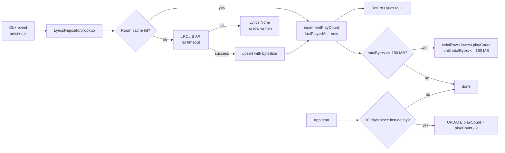

<!-- markdownlint-disable-file -->
# Task Research: Play-Count-Based Lyrics Cache (200 MB)

Heart Radio cycles a small rotation of tracks on heavy repeat. The current plan caches lyrics with a 30-day TTL and an LRU cap of 2 000 rows (Phase 6.2 of `.copilot-tracking/plans/2026-05-01/dab-radio-lyrics-app-plan.instructions.md`). The user wants to retire date-based eviction in favour of a **play-count** policy, sized for a generous **200 MB** budget on the Mekede DUDU7 head unit (eMMC has plenty of room). This document sizes the on-disk footprint of LRC lyric files, dimensions the 200 MB cap against Heart FM's actual rotation, and selects an eviction policy plus a concrete Room schema and migration.

## Task Implementation Requests

* Quantify the on-disk size of an average lyrics file (plain + synced LRC + Room/SQLite overhead).
* Express what 200 MB buys in terms of cached tracks vs Heart FM's actual rotation.
* Replace date-based TTL/LRU with a play-count-driven eviction policy that survives playlist refresh and never re-fetches an unevicted row.
* Provide a concrete Room schema delta, v1→v2 migration, DAO surface, and the call site that increments `playCount`.
* Define what "200 MB" actually measures (content bytes vs SQLite file size on disk).

## Scope and Success Criteria

* Scope: storage sizing and eviction policy for `LyricsCacheEntity` (Phases 6 and 7 of the existing plan). Out of scope: changes to LRCLIB client, LRC parser, lyrics UI, or station tuning.
* Assumptions:
  * Single station of interest is Heart UK (national feed since Feb 2025) — research notes ~300 unique tracks/week, ~1 500–3 000/year.
  * Lyrics text per `(artist, title)` is effectively immutable once cached — re-fetching evicted rows is acceptable but unnecessary in steady state.
  * The DL+ pipeline already debounces and dedupes consecutive identical `(artist, title)` events (Phase 5.2), so each play maps to one increment.
  * Android's bundled SQLite is built **without** `SQLITE_ENABLE_UPDATE_DELETE_LIMIT` — eviction must use `DELETE … WHERE rowid IN (SELECT … LIMIT)`.
* Success Criteria:
  * Per-track planning size is justified by real LRCLIB payloads, not guesses.
  * 200 MB capacity is expressed in tracks and compared to Heart's rotation.
  * Eviction policy is single-column-indexable, ages stale "former hits" out, and never starves brand-new tracks.
  * Concrete Kotlin / SQL artefacts (entity, migration, DAO, policy class, repository call) are ready to drop into Phase 6.

## Outline

* §1 Per-track lyric size (mean / median / p95 / max from 12 live LRCLIB samples).
* §2 SQLite/Room per-row overhead and the recommended planning constant (5 KB/track).
* §3 200 MB capacity vs Heart FM weekly / annual / 5-year rotation.
* §4 Eviction policy alternatives (LFU / Window-TinyLFU / Frecency / **LFU + decay**) and rationale.
* §5 Concrete Room schema delta, migration, DAO, eviction policy class, repository call site.
* §6 What "200 MB" actually measures: `SUM(byteSize)` vs file size.
* §7 Plan-edit checklist — exact lines in `.copilot-tracking/plans/2026-05-01/dab-radio-lyrics-app-plan.instructions.md` and the details file that need to change.

## Potential Next Research

* Empirically validate the ~200 B/row SQLite overhead with an instrumented test on a real Android 7 head unit (1 000 synthetic rows, before/after file size).
  * Reasoning: estimate is from the SQLite file-format spec, not measurement. If real overhead is 2–3× higher, the ~4 % accounting headroom shrinks but stays well within the 10 % high-water gap.
  * Reference: .copilot-tracking/research/subagents/2026-05-01/lyrics-cache-sizing-research.md §"Open questions"
* Survey Heart FM `heart.co.uk/recently-played` over a 14-day window to confirm the ~300 weekly-uniques estimate.
  * Reasoning: if Heart's actual rotation is 2–3× larger, the 200 MB cap is still comfortable but the "140× overkill" framing softens.
* Decide whether to expose 200 MB as a settings slider (50 / 100 / 200 / 500 MB) or hard-code it.
  * Reasoning: trivial to parameterise on `capBytes`; user impact is negligible because eviction will rarely fire.

## Research Executed

### File Analysis

* .copilot-tracking/research/subagents/2026-05-01/lyrics-cache-sizing-research.md
  * Live measurement of 12 Heart-UK rotation tracks via `lrclib.net/api/search`. Mean plain+synced = **4 365 B**, median 4 030, p95 7 393, max 7 703.
  * SQLite per-row overhead derivation citing https://www.sqlite.org/fileformat.html §1.6 / §2.1 / §2.6 — table cell ~73 B + PK auto-index ~57 B → ~130 B base, inflated to ~200 B/row for WAL + page-fill factor.
  * Eviction policy survey: Pure LFU (starvation), Window-TinyLFU (overkill), Frecency (acceptable), LFU + decay (recommended).
  * Full schema delta, migration SQL, DAO additions, and `LyricsCachePolicy` Kotlin scaffold.
* .copilot-tracking/research/subagents/2026-04-30/lyrics-api-research.md (Lines 200–280)
  * Existing cache strategy section — Room schema, TTL discussion, "LRC text doesn't change → never expire successful synced lyrics."
* .copilot-tracking/plans/2026-05-01/dab-radio-lyrics-app-plan.instructions.md
  * Phase 6.1 (`StationEntity`, `LastTunedEntity`, `LyricsCacheEntity`, indices on `(artist COLLATE NOCASE, title COLLATE NOCASE)`).
  * Phase 6.2 (`LyricsCachePolicy` — TTL 30 days, LRU cap 2 000 rows). **This is what changes.**
  * Phase 7.2 (`LyricsRepository.lookup` — Room cache hit first, then API). Increment site lives here.

### External Research

* `curl https://lrclib.net/api/search` × 12 tracks (subagent) — see §1 table.
* SQLite docs:
  * File format — https://www.sqlite.org/fileformat.html
  * `LENGTH()` returns chars for TEXT, **bytes** for BLOB — https://www.sqlite.org/lang_corefunc.html#length
  * `VACUUM` — https://www.sqlite.org/lang_vacuum.html (file size is sticky after DELETE until VACUUM)
  * Compile options (`SQLITE_ENABLE_UPDATE_DELETE_LIMIT` is **off** in Android stock SQLite) — https://www.sqlite.org/compile.html#enable_update_delete_limit
* Cache-policy literature:
  * Caffeine (Window-TinyLFU) — https://github.com/ben-manes/caffeine
  * Mozilla Frecency — https://wiki.mozilla.org/User:Mconnor/PastWork/PlacesFrecency
  * ARC paper, LFU cache-pollution background — Megiddo & Modha 2003.

### Project Conventions

* Single-module Kotlin + Room project; per-feature packages (Phase 1.2 of the plan).
* Hilt-injected singletons for repositories and policy objects (`@Singleton`, `@Inject`).
* Room migrations are explicit (no `fallbackToDestructiveMigration()`); schema JSON is exported under `app/schemas/`.
* In-car best-effort rule from research Scenario 2: lyrics failures **never** block audio. Cache eviction must run off the playback critical path.

## Key Discoveries

### Per-track lyric payload — 12-track Heart-UK sample

| Stat | plain (B) | synced (B) | plain + synced (B) |
|---|---:|---:|---:|
| min | 958 | 1 449 | 2 407 |
| mean | 1 860 | 2 505 | **4 365** |
| median | 1 736 | 2 294 | 4 030 |
| p95 | 3 190 | 4 203 | 7 393 |
| max | 3 361 | 4 342 | 7 703 |

Source: .copilot-tracking/research/subagents/2026-05-01/lyrics-cache-sizing-research.md §"Topic 1".

### Per-row overhead

* Table cell ~73 B + PK auto-index ~57 B = ~130 B base.
* Inflated by ×1.5 for WAL + page-fill factor → **~200 B/row planning constant**.
* Dropping the redundant explicit `Index(value=["artist","title"], unique=true)` (the PK already provides `sqlite_autoindex_lyrics_cache_1`) saves ~85 B/row.

### Headline numbers

* **~4.7 KB/track** end-to-end (lyrics + overhead) → use **5 KB** as the planning constant.
* **200 MB → ~42 000 rows** at 5 KB/track; ~26 000 rows at p95.
* Heart FM weekly hot set ~300 unique tracks → **140× headroom**.
* Heart FM annual rotation ~1 500–3 000 → **14–28× headroom**.
* **Eviction will essentially never fire under normal use.** The cap exists as a defensive ceiling against DL+ junk, station hopping, and multi-year drift.

### Eviction policy comparison

| Policy | SQL | Solves new-song starvation | Code complexity | Verdict |
|---|---|---|---|---|
| Pure LFU | `ORDER BY playCount ASC` | **No** — old hits accumulate, new tracks killed | Trivial | Dangerous alone |
| Window-TinyLFU (Caffeine) | CountMin sketch + segmented LRU | Yes (designed for it) | High (sketch table, aging coroutine) | Overkill |
| Frecency (LFU + LRU hybrid) | `ORDER BY playCount * w1 + (now - lastPlayedAt) * -w2` | Yes (recency vote) | Medium (computed expression, no index) | Viable |
| **LFU + ÷2 decay every 30 days** | `ORDER BY playCount ASC, fetchedAt ASC` | **Yes** (former hits halve to zero in months) | Low (one column + a monthly UPDATE) | **Selected** |

### Complete examples

See §5 below for the full `LyricsCacheEntity`, `MIGRATION_1_2`, `LyricsCacheDao`, `LyricsCachePolicy`, and the `LyricsRepository.lookup` increment site.

## Technical Scenarios

### Scenario A — LFU with periodic decay, 200 MB byte-budget cap (SELECTED)

A single `playCount: Long` column drives eviction. Increment on every successful lookup that returned lyrics to the UI (cache hit *and* fresh fetch). Once a month, halve every row's `playCount` to age out former hits. Eviction triggers when `SUM(byteSize) ≥ 180 MB` (90 % high-water) and deletes lowest-`playCount` rows until total drops below 160 MB (80 % low-water). All SQL is single-column-indexable.

**Requirements:**

* Single integer `playCount` column with a `BTREE` index for `ORDER BY playCount ASC`.
* `byteSize` column materialised at insert so the headroom check is `SELECT SUM(byteSize)` — fast scan over INTEGER, no `LENGTH()` call on TEXT.
* `lastPlayedAt` and `firstPlayedAt` columns kept for telemetry / future frecency upgrade (not used in the eviction predicate today).
* Decay timestamp persisted in DataStore so the once-monthly `UPDATE` runs at most once per period.
* DL+ event debounce already in Phase 5.2 — no per-station cooldown needed yet.

**Preferred Approach:**

* LFU + ÷2 decay over Window-TinyLFU because the hot set (~300 tracks) is two orders of magnitude smaller than the cap, so a Bloom/CountMin sketch buys nothing.
* LFU + decay over pure Frecency because the eviction `ORDER BY` stays index-friendly (single column) instead of a computed expression that forces a full-table scan.
* Byte budget over row-count cap because the user explicitly framed the budget in MB; row-count caps mis-size when payload variance is 3× (max/min ratio).

```text
app/src/main/java/com/example/radiolyric/data/lyrics/
├── LyricsCacheEntity.kt        # +playCount, firstPlayedAt, lastPlayedAt, byteSize columns
├── LyricsCacheDao.kt           # +incrementPlayCount, totalBytes, evictRows, decayAllPlayCounts
├── LyricsCachePolicy.kt        # 200 MB cap, 90 % / 80 % water marks, 30-day decay gate
└── migrations/
    └── MIGRATION_1_2.kt        # ALTER TABLE + DROP redundant index + CREATE playCount index

app/src/main/java/com/example/radiolyric/data/db/RadioDatabase.kt
└── @Database(version = 2, ...) + .addMigrations(MIGRATION_1_2)
```



**Implementation Details:**

`LyricsCacheEntity` (Kotlin):

```kotlin
@Entity(
    tableName = "lyrics_cache",
    primaryKeys = ["artist", "title"],
    // Drop the redundant explicit Index on (artist,title) — the composite PK
    // already creates sqlite_autoindex_lyrics_cache_1 covering the same lookup.
    indices = [Index(value = ["playCount"])]
)
data class LyricsCacheEntity(
    @ColumnInfo(collate = ColumnInfo.NOCASE) val artist: String,
    @ColumnInfo(collate = ColumnInfo.NOCASE) val title: String,
    val syncedLyrics: String?,
    val plainLyrics: String?,
    val provider: String,
    val fetchedAt: Long,
    // --- v2 additions ---
    @ColumnInfo(defaultValue = "0") val playCount: Long,
    @ColumnInfo(defaultValue = "0") val firstPlayedAt: Long,
    @ColumnInfo(defaultValue = "0") val lastPlayedAt: Long,
    @ColumnInfo(defaultValue = "0") val byteSize: Long, // cached LENGTH(plain)+LENGTH(synced)
)
```

Migration v1 → v2:

```kotlin
val MIGRATION_1_2 = object : Migration(1, 2) {
    override fun migrate(db: SupportSQLiteDatabase) {
        db.execSQL("ALTER TABLE lyrics_cache ADD COLUMN playCount INTEGER NOT NULL DEFAULT 0")
        db.execSQL("ALTER TABLE lyrics_cache ADD COLUMN firstPlayedAt INTEGER NOT NULL DEFAULT 0")
        db.execSQL("ALTER TABLE lyrics_cache ADD COLUMN lastPlayedAt INTEGER NOT NULL DEFAULT 0")
        db.execSQL("ALTER TABLE lyrics_cache ADD COLUMN byteSize INTEGER NOT NULL DEFAULT 0")
        // Backfill byteSize for any v1 rows. CAST to BLOB so LENGTH() returns bytes
        // (per https://www.sqlite.org/lang_corefunc.html#length, LENGTH(TEXT) returns chars).
        db.execSQL(
            """
            UPDATE lyrics_cache
            SET byteSize = COALESCE(LENGTH(CAST(plainLyrics  AS BLOB)), 0)
                         + COALESCE(LENGTH(CAST(syncedLyrics AS BLOB)), 0)
            """.trimIndent()
        )
        // Drop redundant unique index Room emitted at v1; add the eviction index.
        db.execSQL("DROP INDEX IF EXISTS index_lyrics_cache_artist_title")
        db.execSQL("CREATE INDEX IF NOT EXISTS index_lyrics_cache_playCount ON lyrics_cache(playCount)")
    }
}
```

DAO additions:

```kotlin
@Dao
interface LyricsCacheDao {

    // Atomic upsert that materialises byteSize at write time.
    @Query("""
        INSERT INTO lyrics_cache(
            artist, title, syncedLyrics, plainLyrics, provider, fetchedAt,
            playCount, firstPlayedAt, lastPlayedAt, byteSize
        )
        VALUES(
            :artist, :title, :synced, :plain, :provider, :now,
            0, :now, :now,
            COALESCE(LENGTH(CAST(:plain AS BLOB)), 0) + COALESCE(LENGTH(CAST(:synced AS BLOB)), 0)
        )
        ON CONFLICT(artist, title) DO UPDATE SET
            syncedLyrics = excluded.syncedLyrics,
            plainLyrics  = excluded.plainLyrics,
            provider     = excluded.provider,
            fetchedAt    = excluded.fetchedAt,
            byteSize     = excluded.byteSize
    """)
    suspend fun upsert(
        artist: String, title: String,
        synced: String?, plain: String?,
        provider: String, now: Long,
    )

    @Query("""
        UPDATE lyrics_cache
        SET playCount = playCount + 1,
            lastPlayedAt = :now
        WHERE artist = :artist AND title = :title
    """)
    suspend fun incrementPlayCount(artist: String, title: String, now: Long): Int

    @Query("SELECT COALESCE(SUM(byteSize), 0) FROM lyrics_cache")
    suspend fun totalBytes(): Long

    // Android's bundled SQLite is compiled WITHOUT SQLITE_ENABLE_UPDATE_DELETE_LIMIT
    // (https://www.sqlite.org/compile.html#enable_update_delete_limit), so we cannot use
    // DELETE ... ORDER BY ... LIMIT directly. Subquery via rowid is portable.
    @Query("""
        DELETE FROM lyrics_cache
        WHERE rowid IN (
            SELECT rowid FROM lyrics_cache
            ORDER BY playCount ASC, fetchedAt ASC
            LIMIT :rowsToDelete
        )
    """)
    suspend fun evictRows(rowsToDelete: Int): Int

    @Query("UPDATE lyrics_cache SET playCount = playCount / 2")
    suspend fun decayAllPlayCounts(): Int
}
```

`LyricsCachePolicy` (replaces the Phase 6.2 TTL/LRU policy):

```kotlin
@Singleton
class LyricsCachePolicy @Inject constructor(
    private val dao: LyricsCacheDao,
    private val settings: SettingsRepository,
    private val clock: Clock,
) {
    private val capBytes        = 200L * 1024 * 1024       // 200 MB hard cap
    private val highWaterBytes  = (capBytes * 0.9).toLong() // trigger at 180 MB
    private val lowWaterBytes   = (capBytes * 0.8).toLong() // drop to 160 MB
    private val avgRowBytes     = 5_000L                    // §1+§2 planning constant
    private val decayPeriodMs   = 30L * 24 * 60 * 60 * 1000

    suspend fun evictIfNeeded() {
        val total = dao.totalBytes()
        if (total < highWaterBytes) return
        val excess = total - lowWaterBytes
        val rowsToDelete = (excess / avgRowBytes).coerceAtLeast(1L).toInt()
        dao.evictRows(rowsToDelete)
    }

    suspend fun maybeDecay() {
        val now  = clock.nowMillis()
        val last = settings.lastDecayAt.first()
        if (now - last < decayPeriodMs) return
        dao.decayAllPlayCounts()
        settings.setLastDecayAt(now)
    }
}
```

`LyricsRepository.lookup` increment site (replaces the Phase 7.2 body):

```kotlin
suspend fun lookup(artist: String, title: String): Lyrics {
    val cached = dao.find(artist, title)
    if (cached != null) {
        dao.incrementPlayCount(artist, title, now = clock.nowMillis())
        return cached.toLyrics(parser)
    }
    val fetched = runCatching {
        withTimeout(3.seconds) { api.search(title, artist).firstOrNull() }
    }.getOrNull() ?: return Lyrics.None
    dao.upsert(artist, title, fetched.syncedLyrics, fetched.plainLyrics, "lrclib", clock.nowMillis())
    dao.incrementPlayCount(artist, title, now = clock.nowMillis()) // first play counts
    policy.evictIfNeeded()
    return fetched.toLyrics(parser)
}
```

What "200 MB" measures — `SUM(byteSize)`, not file size:

* `SUM(byteSize)` is content bytes — what users mentally call "cached lyrics", deterministic after DELETE, fast (single INTEGER column scan).
* `File(database.path).length()` is sticky at the high-water mark until `VACUUM` runs (https://www.sqlite.org/lang_vacuum.html); using it for the eviction predicate produces the wrong behaviour (deletes don't move the metric).
* Fixed overhead at 42 000 rows is ~8 MB → ~4 % accounting error vs the 200 MB cap, comfortably absorbed by the 10 % high-water headroom (180 MB trigger).
* Optional monthly `VACUUM` (alongside decay) keeps file size loosely tracking content size for any user who inspects it externally.

Plan-edit checklist (apply when transitioning from research to plan):

* `.copilot-tracking/plans/2026-05-01/dab-radio-lyrics-app-plan.instructions.md` — Phase 6.2: replace `(TTL 30 days, LRU cap 2000 rows, eviction in a coroutine on app start)` with `(LFU + monthly ÷2 decay, byte-budget cap 200 MB with 180 MB high-water / 160 MB low-water, eviction triggered after each cache write)`.
* `.copilot-tracking/plans/2026-05-01/dab-radio-lyrics-app-plan.instructions.md` — Phase 6.1: drop the explicit `Index(value=["artist","title"], unique=true)`; add `Index(value=["playCount"])`; add columns `playCount`, `firstPlayedAt`, `lastPlayedAt`, `byteSize`. Bump DB version to 2 and reference `MIGRATION_1_2`.
* `.copilot-tracking/details/2026-05-01/dab-radio-lyrics-app-details.md` — Step 6.1 schema block (entity definition) and Step 6.2 policy block — replace per §5 of this document.
* `.copilot-tracking/details/2026-05-01/dab-radio-lyrics-app-details.md` — Step 7.2 — replace lookup body with the `incrementPlayCount` + `evictIfNeeded` flow.
* `SettingsRepository` (Phase 6.3) — add `lastDecayAt: Flow<Long>` + `setLastDecayAt(Long)` DataStore key.
* `RadioLyricApp.onCreate` — call `policy.maybeDecay()` from a background coroutine.

#### Considered Alternatives

* **Keep the existing date-based TTL + LRU cap (2 000 rows).** Rejected: contradicts the user's explicit "based on times played rather than date" framing and ignores the head-unit's storage headroom.
* **Pure LFU with no decay.** Rejected: classic LFU cache pollution — dropped-from-rotation tracks accumulate sky-high counts and never evict; new chart entries with `playCount = 1` get killed first under pressure (https://github.com/ben-manes/caffeine/wiki/Efficiency).
* **Window-TinyLFU (Caffeine algorithm).** Rejected for this app: state-of-the-art, but requires a CountMin sketch table + segmented LRU + aging coroutine for a hot set of ~300 tracks against a 42 000-slot ceiling. Eviction will rarely fire — engineering cost is unjustified.
* **Frecency (`score = playCount * w1 + (now - lastPlayedAt) * -w2`).** Rejected as primary: the computed `ORDER BY` cannot use a single-column index, forcing a full-table scan on every eviction. At 42 000 rows max this is still ms-scale, but pure LFU + decay is simpler and produces the same outcome for this workload. Frecency is preserved as a future upgrade — `firstPlayedAt` and `lastPlayedAt` columns are written today even though the eviction predicate ignores them.
* **Row-count cap (e.g. 40 000 rows) instead of byte budget.** Rejected: payload variance is 3× (max/min). A row-count cap mis-sizes when the cache fills with rap tracks (denser lyrics) vs ballads. The user framed the budget in MB — match that.
* **Measure cache size with `File(database.path).length()`.** Rejected: file size is sticky after DELETE until `VACUUM` (https://www.sqlite.org/lang_vacuum.html). The eviction predicate would not move monotonically as rows are deleted, making the high-water trigger oscillate.
* **Use `LENGTH(plainLyrics)` directly in the eviction query.** Rejected: SQLite `LENGTH()` returns characters for TEXT, bytes for BLOB (https://www.sqlite.org/lang_corefunc.html#length). Caching `byteSize` at insert sidesteps the footgun and turns the headroom check into a single-column INTEGER scan.
